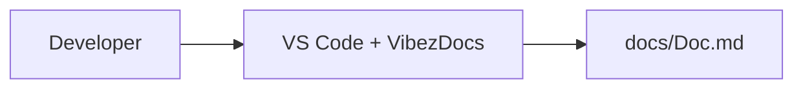

# VibezDocs

## Architecture
- backend unknown activity detected in c:/Users/thant/AppData/Roaming/Code/User/settings.json
- backend unknown activity detected in .gitignore
- • **Updated .gitignore**: Added new file patterns to ignore dependencies, build outputs, generated JavaScript files, packaging,...
- • **Inferred unknown .gitignore**: The update was made to an unknown or existing .gitignore file, resulting in 2 new additions...

## APIs
- (none yet)

## Components
- (none yet)

## Database
- (none yet)

## Pages
- (none yet)

## Development Timeline
- 2026-03-29T07:37:06.350Z: Updated in c:/Users/thant/AppData/Roaming/Code/User/settings.json (unknown)
- 2026-03-29T12:57:47.047Z: Updated in .gitignore (unknown)

## C4 Diagram (Mermaid format)

